# ✈️ Flight Delay Prediction

> **Can we predict whether a U.S. domestic flight will arrive 15+ minutes late — using only information available before departure?**

[](https://python.org)
[](https://scikit-learn.org)
[](https://jupyter.org)
[](https://www.kaggle.com/datasets/usdot/flight-delays)

**Data Bootcamp Final Project** · 5.8M flight records · 5 ML models · Binary + Multi-class classification

---

## 📋 Table of Cotents

- [Project Overview](#-project-overview)
- [Dataset](#-dataset)
- [Repository Structure](#-repository-structure)
- [How to Run](#-how-to-run)
- [Data Preprocessing](#-data-preprocessing)
- [Exploratory Data Analysis](#-exploratory-data-analysis)
- [Feature Engineering](#-feature-engineering)
- [Models & Class Imbalance](#-models--class-imbalance)
- [Binary Classification Results](#-binary-classification-results)
- [Feature Importance & Lift](#-feature-importance--lift)
- [Extended Analysis](#-extended-analysis)
- [Multi-Class Prediction](#-multi-class-prediction)
- [Conclusion](#-conclusion)
- [Requirements](#-requirements)

---

## 🎯 Project Overview

Flight delays cost U.S. airlines and passengers billions of dollars annually. This project asks: **can machine learning identify high-risk flights before they ever depart?**

Using the 2015 USDOT dataset of ~5.8 million domestic flights, we:

1. Build and compare **5 binary classifiers** to predict delay (>15 min arrival delay)
2. Handle severe **class imbalance** (82.4% on-time vs 17.6% delayed)
3. Apply **GridSearchCV** for hyperparameter tuning
4. Quantify business value with a **profit curve analysis**
5. Extend to **4-class prediction**: On Time / Short Delay / Long Delay / Cancelled

**Key constraint:** Only pre-departure features are used — no data that would only be known after the flight has taken off.

---

## 📦 Dataset

**Source:** [2015 Flight Delays and Cancellations — Kaggle / USDOT](https://www.kaggle.com/datasets/usdot/flight-delays)

| File | Rows | Description |
|---|---|---|
| `flights.csv` | ~5.8M | Flight records with schedule, delay breakdown, cancellation info |
| `airlines.csv` | 14 | IATA code → full airline name |
| `airports.csv` | 322 | IATA code → city, state, latitude, longitude |

> ⚠️ **Data files are not included** in this repository due to file size. Download from the Kaggle link above and place all three CSVs in the same directory as the notebook before running.

**Target variable:** `ARRIVAL_DELAY > 15 minutes` (FAA standard definition of a delay)

---

## 📁 Repository Structure

```
flight-delay-prediction/
│
├── flight_delay_prediction.ipynb   # Complete notebook: EDA + modeling + extended analysis
├── images/                         # All plots referenced in this README
├── README.md
└── requirements.txt
```

---

## 🚀 How to Run

```bash
# 1. Clone the repository
git clone https://github.com/YOUR_USERNAME/flight-delay-prediction.git
cd flight-delay-prediction

# 2. Install dependencies
pip install -r requirements.txt

# 3. Download the dataset from Kaggle
#    Place flights.csv, airlines.csv, airports.csv in the project root

# 4. Launch the notebook
jupyter notebook flight_delay_prediction.ipynb
```

Run all cells from top to bottom. The notebook will sample 200,000 rows from the full dataset for manageable runtime (~5–10 min total on a standard laptop).

---

## 🧹 Data Preprocessing

### Target Creation

The binary target is derived from `ARRIVAL_DELAY` **before** any columns are dropped:

```python
flights['DELAYED'] = (flights['ARRIVAL_DELAY'] > 15).astype('Int64')
```

Using the FAA standard: a flight is considered delayed if it arrives more than **15 minutes late**.

### Dropping Data Leakage Columns

A critical step is removing any column that would only be known **after the flight lands** — using these would make the model useless in practice:

| Dropped Column | Reason |
|---|---|
| `DEPARTURE_TIME` / `DEPARTURE_DELAY` | Actual vs scheduled — only known at gate |
| `TAXI_OUT`, `WHEELS_OFF`, `AIR_TIME` | In-flight measurements |
| `WHEELS_ON`, `TAXI_IN`, `ARRIVAL_TIME` | Post-landing data |
| `ARRIVAL_DELAY` | This is our target variable |
| `WEATHER_DELAY`, `AIRLINE_DELAY`, etc. | Post-flight delay attribution |
| `DIVERTED`, `CANCELLED` | Post-flight outcomes |

After dropping, only **9 pre-departure features** remain for modeling.

### Class Distribution

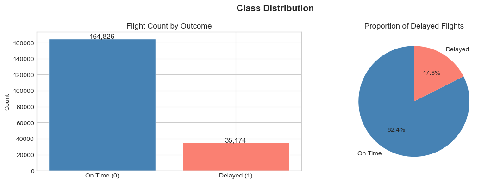

The dataset is heavily imbalanced: **82.4% on-time vs 17.6% delayed**. Without correction, all models collapse to predicting "On Time" for everything — achieving 82.4% accuracy with Recall ≈ 0%.

### Sampling

200,000 rows are randomly sampled from the 5.8M total for manageable local runtime. The delay rate is preserved at 17.6% via stratified sampling.

---

## 📊 Exploratory Data Analysis

### Class Distribution & Overview

The delay rate across 200K sampled flights is **17.6%** (35,174 delayed out of 200,000).

### Delay Rate by Airline


Spirit Air Lines has the highest delay rate at **~28%**, while Hawaiian Airlines has the lowest at **~10%** — nearly a 3× difference driven by route networks, hub congestion, and operational efficiency.

### Delay Rate by Day of Week

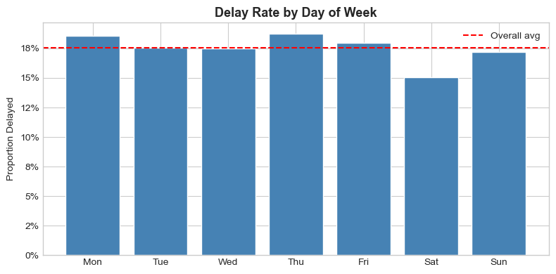

**Thursday** and **Monday** have the highest delay rates (~19%), while **Saturday** is the safest day to fly (~15%). Weekend leisure travel is more predictable; mid-week business travel creates more congestion.

### Delay Rate by Month

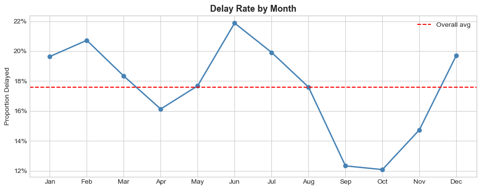

**June** is the worst month at **21.8%** (summer thunderstorm season + peak travel demand). **September** and **October** are the best at just **12%** — post-summer, pre-holiday sweet spot.

### Delay Rate by Departure Hour


The most striking EDA finding: **departure hour is the single strongest predictor of delay**. Early morning flights (5–6am) have just **6.5% delay rates**, while evening flights (18–21h) exceed **24%**. This is the **cascading delay effect** — small disruptions early in the day compound into larger delays by evening.

### Top Delayed Origin Airports

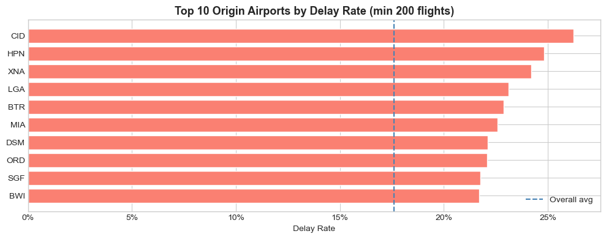

**CID** (Cedar Rapids), **HPN** (White Plains), and **XNA** (Northwest Arkansas) have the highest delay rates (>23%), well above the 17.3% average. These are smaller regional airports with fewer resources to absorb disruptions. **LGA** (LaGuardia) is the notable major hub in the top 10.

### Delay Cause Analysis


- **Weather** causes the longest average delays at **23.5 minutes**
- **Late Aircraft** (a previous flight arriving late) is the most *frequent* cause year-round, accounting for **22.9%** of all delay minutes
- **Air System** (NAS congestion) accounts for **32.2%** of delay minutes
- **Security** and **Airline** causes are comparatively minor

### Delay Causes by Airline

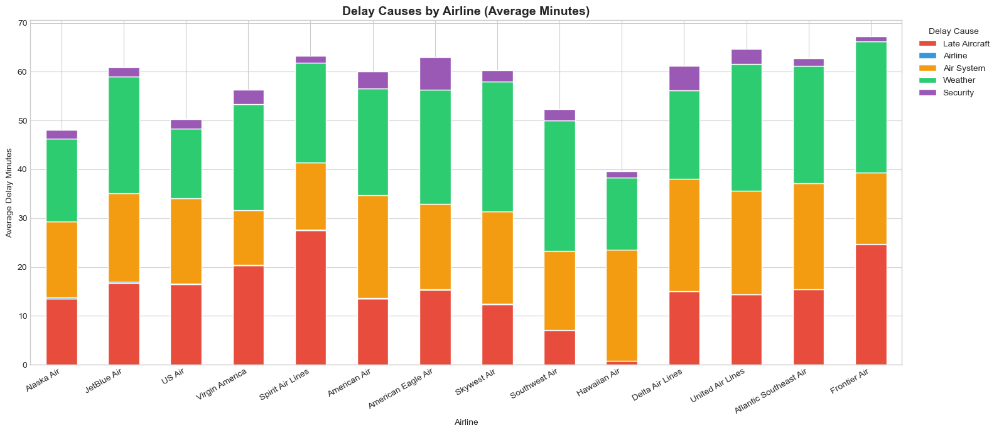

Every airline shows a similar stack composition — Air System and Weather dominate — but total delay burden varies significantly. **Frontier Airlines** and **Atlantic Southeast** accumulate the most total delay minutes per delayed flight.

### Delay Causes by Month

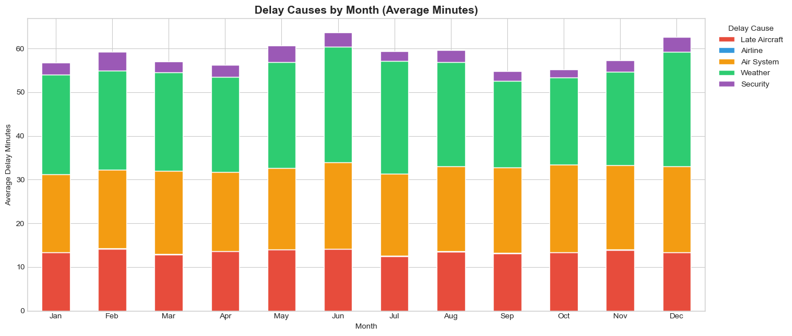

**June** has notably more Weather delay contribution (the green segment), consistent with summer thunderstorm season. January and February also show elevated weather impact from winter storms. September–October have the flattest, lowest profiles.

### Delay Duration Distribution

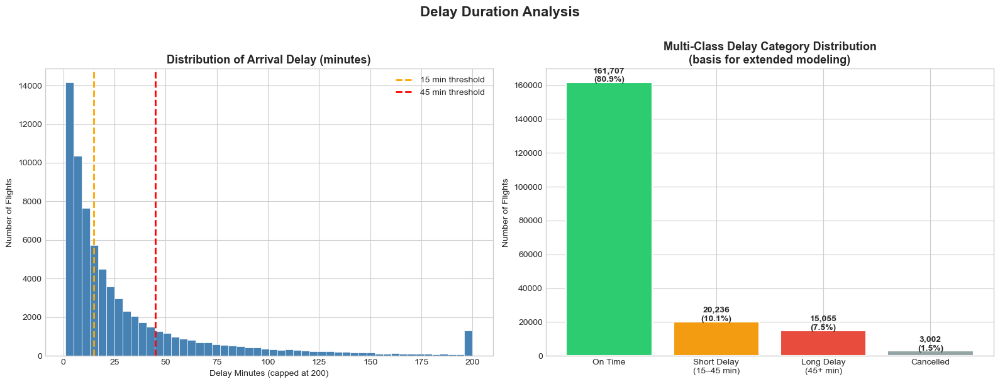

The distribution of arrival delay minutes is **right-skewed** — most delays are under 30 minutes, but a long tail extends beyond 200 minutes. This informs the multi-class bucketing strategy: Short Delay (15–45 min) vs Long Delay (45+ min).

### Cancellation Analysis

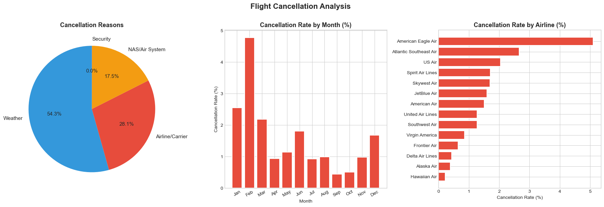

Cancellations affect **1.5%** of all flights. **Weather** is the dominant cause (54.3%), followed by **Airline/Carrier** issues (28.1%) and **NAS/Air System** (17.5%). **February** has the highest cancellation rate (4.8%) due to winter storms. **American Eagle** has the highest airline-level cancellation rate (5.1%) vs **Hawaiian Airlines** at <0.5%.

### State-Level Analysis

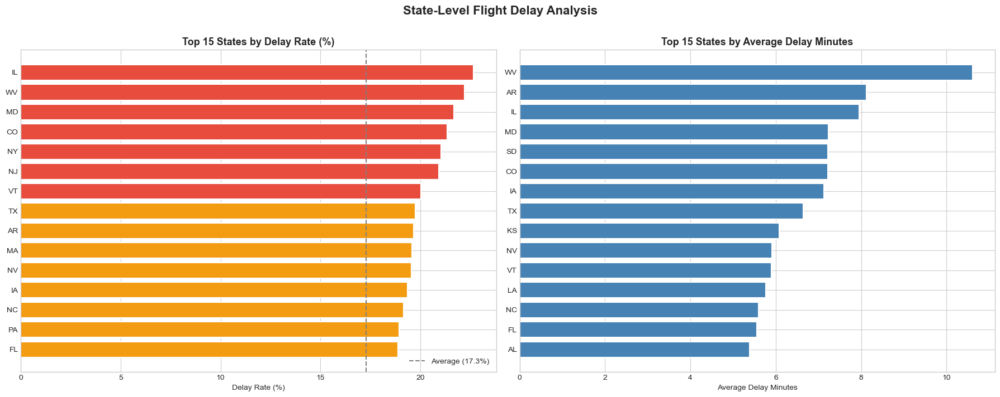

**Illinois** has the highest delay rate (22.7%), driven by ORD (Chicago O'Hare) — one of the busiest and most congestion-prone hubs in the US. **West Virginia** leads in average delay *minutes* despite a lower frequency. Coastal states (NY, MD, NJ) consistently rank in the top tier.

### Route-Level Analysis

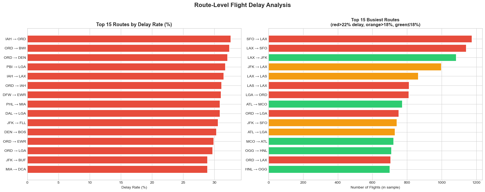

**IAH→ORD** (Houston to Chicago) has the highest delay rate at **32.6%**, followed by **ORD→BWI** (32.4%) and **ORD→DEN** (32.1%). ORD appears in 4 of the top 5 worst routes, confirming Chicago O'Hare as a major network bottleneck. Among the busiest routes by volume, **SFO↔LAX** is highest frequency with above-average delay rates.

### Correlation Heatmap

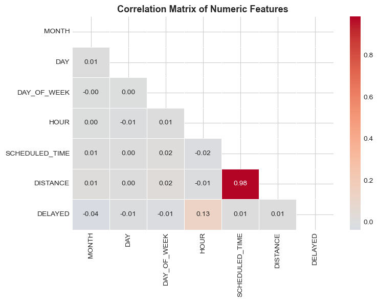

Linear correlations between numeric features and the target are weak (max 0.13 for HOUR). This confirms that tree-based models — which capture non-linear relationships — should outperform linear models. The 0.98 correlation between `SCHEDULED_TIME` and `DISTANCE` reflects the obvious physical relationship and means they provide largely redundant information.

### Box Plots: Delay Duration Distribution

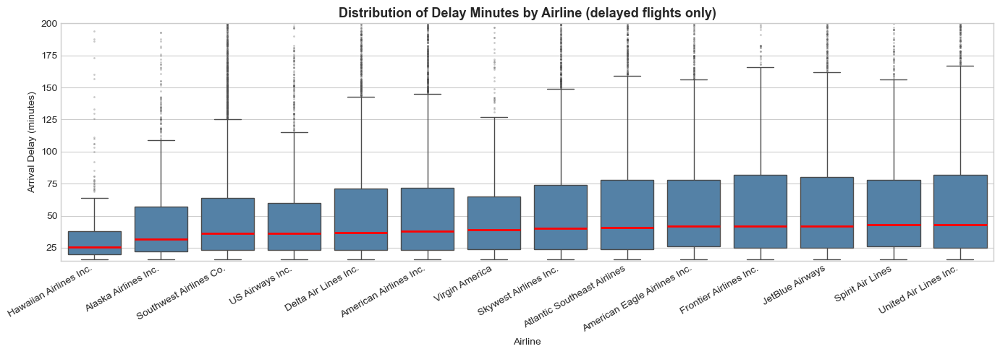

Among delayed flights only: **Hawaiian Airlines** has the lowest median delay (~22 min) and tightest distribution. **United Air Lines** has the widest spread with the highest upper quartile, indicating more severe delays when they occur.

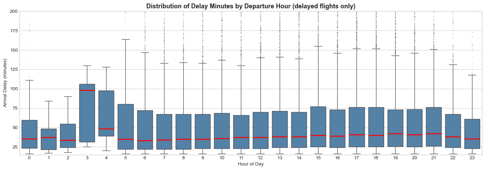

Hours 3–4 AM show the highest median delay duration (100+ minutes) — these are extremely rare flights that are almost always disrupted. For normal operating hours, median delay minutes are relatively stable (~35–40 min) but variance grows in the evening.

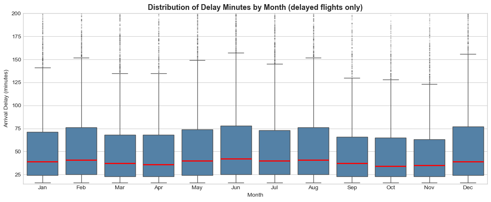

**June** has the highest median delay duration among delayed flights (~43 min), and **December** the widest spread — reflecting the unpredictable severity of holiday-season disruptions.

---

## ⚙️ Feature Engineering

### Features Used

| Type | Features | Encoding |
|---|---|---|
| Categorical | `AIRLINE`, `ORIGIN_AIRPORT`, `DESTINATION_AIRPORT` | OneHotEncoder (drop='first') |
| Numeric | `MONTH`, `DAY`, `DAY_OF_WEEK`, `HOUR`, `SCHEDULED_TIME`, `DISTANCE` | StandardScaler |

**`HOUR`** is derived from `SCHEDULED_DEPARTURE` (stored as HHMM integer): `HOUR = SCHEDULED_DEPARTURE // 100`

**Airport cardinality reduction:** Only the top 30 most frequent origin and destination airports are kept as individual categories. The remaining airports are grouped as `'OTHER'` to reduce the dimensionality of one-hot encoding.

### Train / Test Split

```python
X_train, X_test, y_train, y_test = train_test_split(
    X, y, test_size=0.2, random_state=42, stratify=y
)
# Train: 160,000 rows | Test: 40,000 rows
# Both sets maintain 17.6% delay rate (stratified)
```

### Pipeline Architecture

All models use the same sklearn `Pipeline` — identical to the class workflow:

```
Raw Features → OneHotEncoder (categoricals) → StandardScaler (numerics) → Classifier → Prediction
```

This ensures no data leakage between preprocessing and model evaluation.

---

## 🤖 Models & Class Imbalance

### The Class Imbalance Problem

Without correction, every model predicts "On Time" for all flights:
- **Accuracy = 82.4%** (looks good on paper)
- **Recall = 0%** (completely useless — catches zero real delays)

### Solutions Applied

| Model | Imbalance Fix |
|---|---|
| Logistic Regression | `class_weight='balanced'` |
| K-Nearest Neighbors | 50/50 downsampled training set |
| Decision Tree | `class_weight='balanced'` |
| Naive Bayes | Probabilistic baseline (no explicit fix) |
| Random Forest | `class_weight='balanced'` |

**`class_weight='balanced'`** automatically upweights the minority class (Delayed) by a factor of ~4.7× (= 82.4 ÷ 17.6), forcing the model to treat misclassifying a delayed flight as proportionally more costly.

**KNN downsampling:** Since KNN does not support `class_weight`, the training set is rebalanced to 50/50 by keeping all 28,139 delayed flights and randomly sampling an equal number of on-time flights.

---

## 📈 Binary Classification Results

### Metrics Summary

| Model | Accuracy | Precision | Recall | F1 | ROC-AUC |
|---|---|---|---|---|---|
| Logistic Regression | 59.7% | 24.2% | 60.3% | 34.5% | 0.633 |
| KNN (k=5) | 56.5% | 22.2% | 58.9% | 32.2% | 0.597 |
| Decision Tree | 60.6% | 24.7% | 60.5% | 35.1% | 0.641 |
| Naive Bayes | 63.9% | 21.8% | 40.5% | 28.3% | 0.576 |
| **Random Forest** ⭐ | **60.3%** | **24.8%** | **61.9%** | **35.4%** | **0.653** |

> **Why is Accuracy lower after fixing class imbalance?** Because the models now predict "Delayed" for some flights that turn out to be on time (False Positives). This is the correct trade-off — we sacrifice some accuracy to actually catch real delays.

> **Why is Precision only ~24%?** Pre-departure information alone is genuinely limited — real-time weather, mechanical status, and crew scheduling are unavailable. A 1-in-4 hit rate on delay predictions is still substantially better than random.

> **Why does Naive Bayes have the highest Accuracy but worst Recall?** Classic imbalanced-data pitfall — it achieves 63.9% accuracy by being conservative about predicting delays, but only catches 40.5% of actual delays. For this use case, Recall matters far more than Accuracy.

### Confusion Matrices

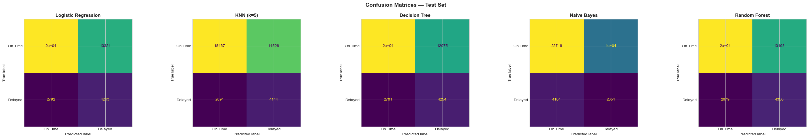

All five models correctly identify the majority of on-time flights (yellow = True Negatives) and capture a meaningful fraction of delayed flights (green = True Positives). The key improvement over uncorrected models: the bottom-right quadrant (True Positives) is no longer empty.

### ROC Curves


**Random Forest** achieves the best ROC-AUC (0.65), followed closely by Decision Tree (0.64) and Logistic Regression (0.63). KNN lags slightly at 0.60. All models substantially outperform the random baseline.

### Precision-Recall Tradeoff

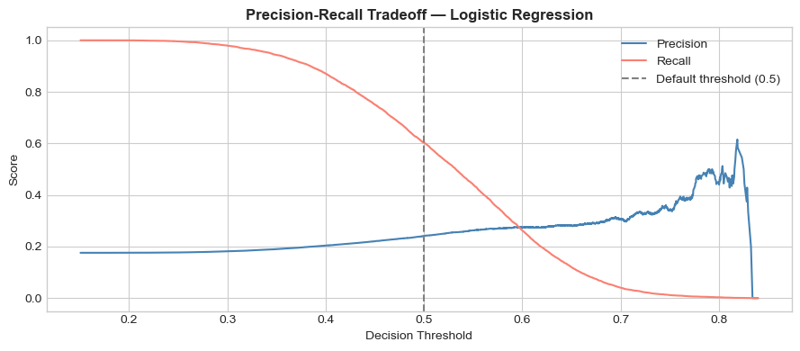

This curve shows the fundamental tradeoff for Logistic Regression: at the default threshold of 0.5, Recall ≈ 60% and Precision ≈ 24%. **Lowering the threshold** (e.g. to 0.35) would increase Recall toward 80%+ at the cost of more false alarms. For a **passenger-facing alert system**, higher Recall is preferred — it is better to warn unnecessarily than to miss a real delay. For an **airline resource allocation tool**, a higher threshold conserves operational resources.

---

## 🎯 Feature Importance & Lift

### Random Forest Feature Importance

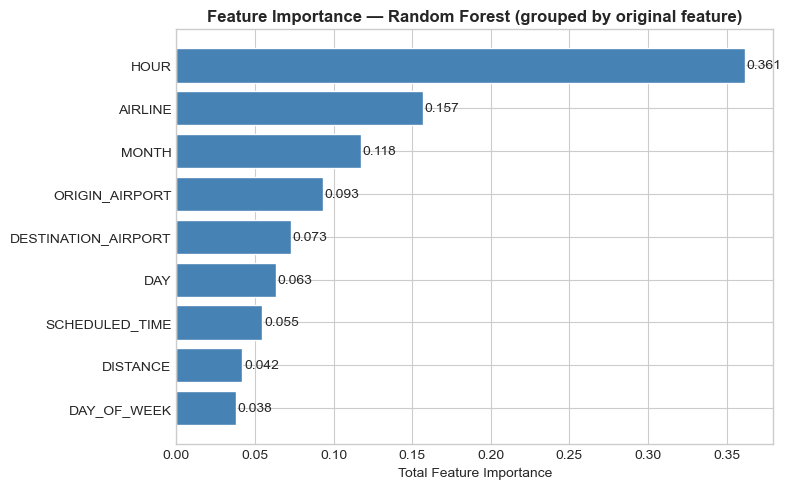

| Rank | Feature | Importance | Interpretation |
|---|---|---|---|
| 1 | `HOUR` | **0.361** | 36% of all prediction power — evening cascades |
| 2 | `AIRLINE` | 0.157 | Spirit 28% vs Hawaiian 10% delay rate |
| 3 | `MONTH` | 0.118 | June 21.8% vs October 12.1% |
| 4 | `ORIGIN_AIRPORT` | 0.093 | CID, HPN, LGA systematically higher |
| 5 | `DESTINATION_AIRPORT` | 0.073 | Destination congestion matters too |
| 6 | `DAY` | 0.063 | Day of month has minor effect |
| 7 | `SCHEDULED_TIME` | 0.055 | Longer flights slightly more delay-prone |
| 8 | `DISTANCE` | 0.042 | Near-redundant with SCHEDULED_TIME (r=0.98) |
| 9 | `DAY_OF_WEEK` | 0.038 | Weakest signal — Thursday vs Saturday |

**HOUR alone contributes more than AIRLINE + MONTH combined.** The departure time is the single most actionable piece of pre-flight information for delay risk.

### Lift Analysis

Ranking all test flights by predicted delay probability (highest to lowest):

| Threshold | Flights Flagged | Delays Captured | Lift vs Random |
|---|---|---|---|
| Top 10% | 4,000 | ~21% of all delays | 2.1× |
| **Top 20%** | **8,000** | **33.9% of all delays** | **1.69×** |
| Top 30% | 12,000 | ~43% of all delays | 1.43× |
| Random 20% | 8,000 | ~20% of all delays | 1.0× (baseline) |

**Business application:** An airline flagging the top 20% highest-risk flights for proactive intervention would capture 1-in-3 actual delays while only examining 1-in-5 flights.

### Example Prediction

```
Flight:   Southwest Airlines (WN) · ORD → LAX
Date:     Friday, July 4th
Time:     6:00 PM departure
Distance: 1,744 miles

Predicted delay probability:  61.3%
Prediction:                   DELAYED ⚠️
```

This flight combines several high-risk factors: evening departure, July (summer), Friday (busy travel day), and ORD (Chicago O'Hare — a chronically congested hub).

---

## 🔬 Extended Analysis

### GridSearchCV — Decision Tree (Recall-Optimized)

To maximize delay detection (Recall), GridSearchCV was applied to the Decision Tree with a recall-focused cross-validation strategy:

| Parameter | Best Value | Result |
|---|---|---|
| `max_depth` | 1 | A single split on HOUR is optimal |
| CV Recall (5-fold) | **71.4%** | +10.9 pp over default DT |
| Test Recall | **70.8%** | Best recall of any model |
| Test ROC-AUC | 0.576 | Trades ranking quality for threshold recall |

**Key insight:** A depth-1 Decision Tree — effectively a single threshold on departure hour — already captures 70.8% of all delays. This powerfully validates HOUR as the dominant feature.

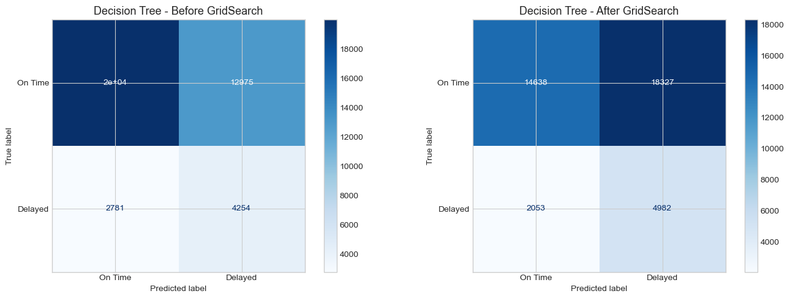

After GridSearchCV, the Decision Tree catches **4,982 true delays** vs 4,254 before tuning — a 17% improvement in delay detection. The cost is more false positives (18,327 vs 12,975), which is acceptable for a recall-maximizing application.

### Profit Curve Analysis

Assuming a business context where:
- **True Positive** (correctly flagging a delayed flight) = **+$50** revenue (e.g. proactive rebooking value)
- **False Positive** (flagging an on-time flight) = **−$10** cost (e.g. unnecessary intervention)


| Model | Max Simulated Profit | Optimal % Flagged |
|---|---|---|
| **KNN** | **$1,191,100** | 59.9% |
| Decision Tree (default) | $418,390 | 47.0% |
| Random Forest | $413,620 | 49.9% |
| Logistic Regression | $318,330 | 53.3% |
| Decision Tree (tuned) | $267,100 | 58.6% |

**Surprising finding:** KNN achieves the highest simulated profit despite having the lowest ROC-AUC. This is because KNN's probability estimates are better-calibrated at the specific threshold region that maximizes this profit function. The takeaway: **ROC-AUC and business value are not always aligned** — profit curves provide a more actionable evaluation framework for deployment decisions.

---

## 🎯 Multi-Class Prediction

### Class Definitions

The 4-class problem reframes the target variable:

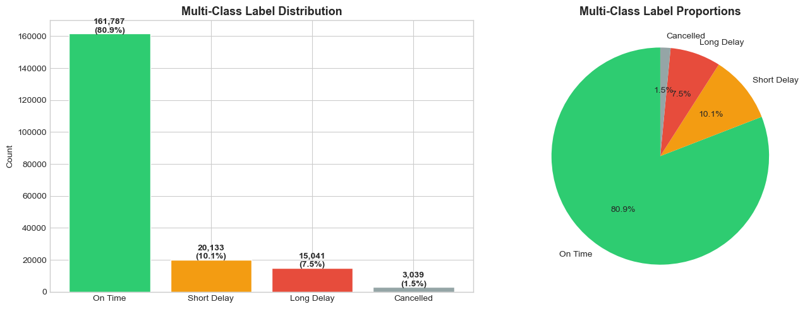

| Class | Definition | Count | Proportion |
|---|---|---|---|
| On Time | ARRIVAL_DELAY ≤ 15 min | 161,787 | 80.9% |
| Short Delay | 15 < ARRIVAL_DELAY ≤ 45 min | 20,133 | 10.1% |
| Long Delay | ARRIVAL_DELAY > 45 min | 15,041 | 7.5% |
| Cancelled | CANCELLED = 1 | 3,039 | 1.5% |

### Multi-Class Results

| Model | Train Accuracy | Test Accuracy |
|---|---|---|
| Logistic Regression | 42.1% | 42.1% |
| Decision Tree | 41.9% | 40.6% |
| **Random Forest (tuned)** | **99.9%** | **80.6%** |

GridSearchCV best parameters for Random Forest: `max_depth=None`, `n_estimators=100`, CV accuracy = 80.7%

### Confusion Matrices


The tuned Random Forest dominates at On Time prediction (32,145 correct out of 32,360 — 99% recall). However, it struggles severely with minority classes: Long Delay recall = 1%, Short Delay recall = 1%, Cancelled recall = 4%. The model has essentially learned to be a very good On Time detector but cannot distinguish between delay severities.

### Train vs Test Accuracy

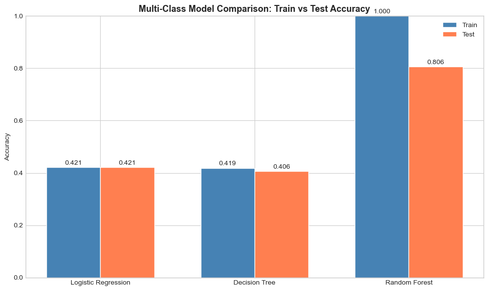

The severe gap between Random Forest train accuracy (99.9%) and test accuracy (80.6%) is a textbook overfitting signature. The unconstrained forest memorizes training data. **Next step:** add `max_depth=15` or `min_samples_leaf=50` constraints to regularize.

---

## 🏁 Conclusion

### Summary of Findings

**Binary Classification:**
- **Random Forest** is the best overall model: Recall = 61.9%, F1 = 0.354, ROC-AUC = 0.653
- **Departure hour** is the dominant feature (importance = 0.361), accounting for more predictive power than all other features combined
- Class imbalance correction is **essential** — without it, all models achieve Recall ≈ 0%
- Targeting the top 20% highest-risk flights captures **33.9% of all delays** (1.69× lift)

**Extended Analysis:**
- A depth-1 Decision Tree (single split on HOUR) achieves 70.8% Recall — demonstrating the primacy of departure time
- KNN outperforms on the profit curve ($1.19M) despite lower AUC, showing ROC-AUC ≠ business value
- Multi-class Random Forest reaches 80.6% test accuracy but severely overfits (train 99.9%)

### Limitations

| Limitation | Impact |
|---|---|
| 2015 data only | Post-COVID delay patterns, airline mergers, and route changes likely differ |
| No real-time weather | Precipitation, wind speed, snowfall would likely improve predictions significantly |
| 200K sample | Training on all 5.8M records would improve performance, especially for rare patterns |
| Airport grouping | Airports outside top 30 are grouped as `OTHER`, losing location signal for smaller airports |
| Multi-class overfitting | RF train 99.9% vs test 80.6% — minority delay classes have near-zero recall |

### Next Steps

- **Add weather data:** Join NOAA daily weather by origin airport and date (temperature, precipitation, wind)
- **Fix multi-class overfitting:** Constrain `max_depth` and increase `min_samples_leaf` in Random Forest
- **Try XGBoost:** Expected to outperform Random Forest on both tasks with better regularization
- **Time-based split:** Train on Jan–Sep, test on Oct–Dec to simulate real deployment
- **Calibrate probabilities:** Apply `CalibratedClassifierCV` to improve probability estimates for profit curve optimization

---

## 📦 Requirements

```
pandas>=2.0
numpy==1.26.4
matplotlib>=3.7
seaborn>=0.12
scikit-learn>=1.4
jupyter
```

Install all dependencies:

```bash
pip install -r requirements.txt
```

> **Note:** `numpy==1.26.4` is pinned for compatibility with `sktime` if used for time series extensions.

---

## 📄 License

This project is for educational purposes as part of a Data Bootcamp final project. Dataset is publicly available via Kaggle / USDOT.
