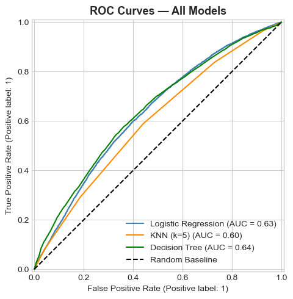
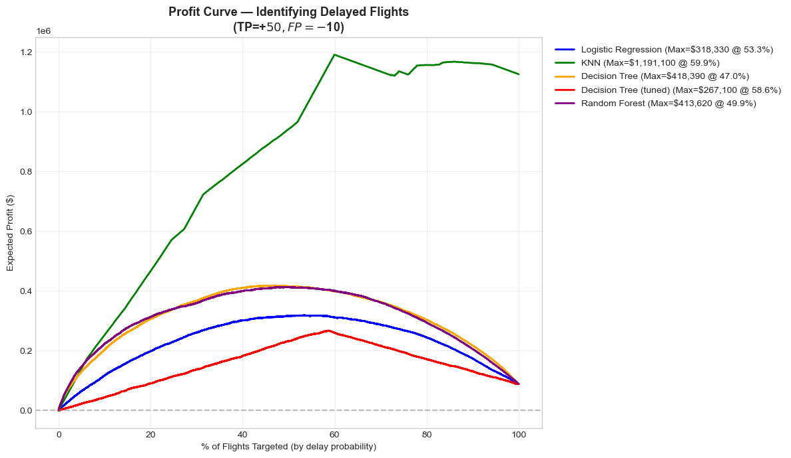
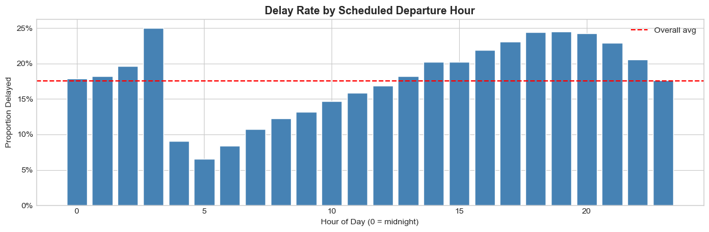
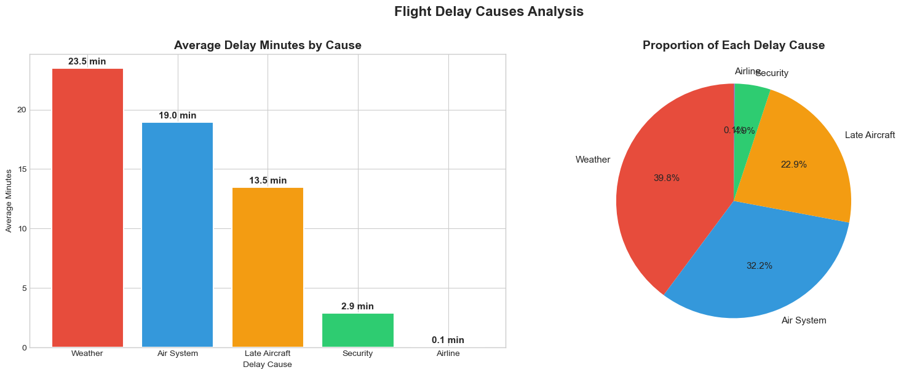
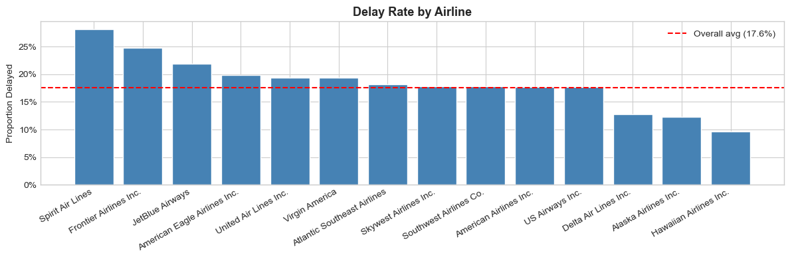
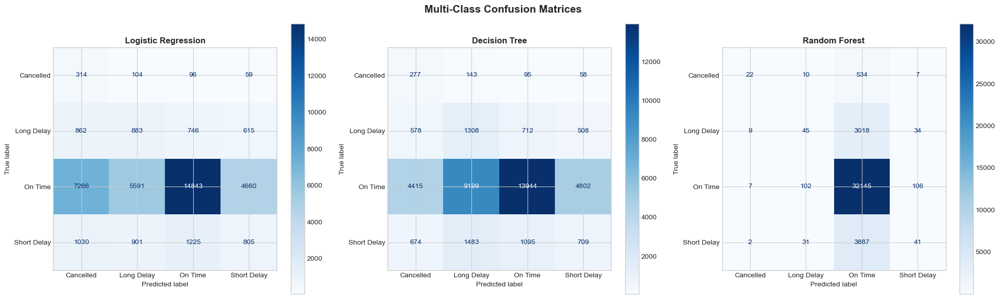

# Flight Delay Prediction — 5.8M U.S. Domestic Flights

> Can a flight's arrival delay be predicted using only information available
> *before* it departs? Five classifiers on the 2015 USDOT dataset say: partly —
> and the honest answer to "how well" is more interesting than the headline number.

[](https://python.org)
[](https://scikit-learn.org)
[](https://www.kaggle.com/datasets/usdot/flight-delays)


**Contributors:** He (Helen) Tu, Siye Li
**Course:** ECON-UB 232 Data Bootcamp, NYU Stern — Spring 2026

---

## Overview

Flight delays cost U.S. airlines and passengers billions of dollars a year. The
question here is deliberately constrained: using **only pre-departure
information** — airline, origin, destination, month, day of week, scheduled
hour, scheduled duration, and distance — can we flag which flights will arrive
more than 15 minutes late?

The constraint is what makes the problem honest. Post-hoc features like
`DEPARTURE_DELAY` would push accuracy far higher while being useless in
practice: by the time you know a flight left late, you no longer need a model.

## Key Results

Five binary classifiers, evaluated on a held-out test set of 40,000 flights:

| Model | Accuracy | Precision | Recall | F1 | ROC-AUC |
| --- | --- | --- | --- | --- | --- |
| Logistic Regression | 0.5971 | 0.2415 | 0.6031 | 0.3449 | 0.6328 |
| K-Nearest Neighbours (k=5) | 0.5645 | 0.2219 | 0.5891 | 0.3224 | 0.5968 |
| Decision Tree | 0.6061 | 0.2469 | 0.6047 | 0.3506 | 0.6410 |
| Naive Bayes | 0.6392 | 0.2177 | 0.4053 | 0.2832 | 0.5757 |
| **Random Forest** | 0.6031 | **0.2481** | **0.6192** | **0.3543** | **0.6530** |

**Random Forest is the best model at ROC-AUC 0.653.** That is a modest number,
and it should be. Precision sits near 24% because roughly 18% of flights are
delayed and pre-departure signal alone cannot separate them cleanly — the
dominant causes (weather, late inbound aircraft) are simply not knowable from a
schedule.

Where the model does earn its keep is in **ranking** rather than classification:

> Targeting the **top 20%** of flights by predicted risk captures **33.9%** of
> all actual delays (2,382 of 7,035) — a **1.69× lift** over random selection.



---

## A note on the profit curve

An earlier version of this README reported a maximum expected profit of
**$1.19M for KNN**, which looked like the standout result. It was an artifact,
and the correction is worth documenting.

The profit curve (TP = +$50, FP = −$10) was computed on **training** data. Four
of the five models were scored on the 160,000-row training set at its natural
17.6% delay rate. KNN, however, was trained on a **downsampled balanced set** of
56,278 rows at a 50% delay rate — so its curve had roughly five times the
positive base rate to earn from, on data a k=5 neighbour model had effectively
memorised.

| Model | Max profit (in-sample) | Threshold | Scored on |
| --- | --- | --- | --- |
| Logistic Regression | $318,330 | 53.3% | 160k @ 17.6% delayed |
| Decision Tree | $418,390 | 47.0% | 160k @ 17.6% delayed |
| Random Forest | $413,620 | 49.9% | 160k @ 17.6% delayed |
| ~~KNN~~ | ~~$1,191,100~~ | 59.9% | 56k @ **50%** delayed — not comparable |

On the held-out test set KNN is the **worst** of the five (ROC-AUC 0.597). The
defensible figures are the **$413K–418K** for Decision Tree and Random Forest,
and even those are in-sample; no test-set profit curve was computed.



---

## What the data says



- **Departure hour is the strongest single signal.** Delay rates climb steadily
  through the day and exceed 24% after 6pm as disruptions cascade forward. A
  `GridSearchCV` over Decision Tree depth optimising for recall selected
  **`max_depth=1`** — a stump that splits on hour alone, achieving CV recall
  0.714. That is a blunt result, but a genuine one about where the signal lives.
- **Airline matters.** Spirit had the highest delay rate (~28%), Hawaiian the
  lowest (~10%).
- **Seasonality.** June was worst at 21.8%; September best.
- **Cause profile.** Weather produces the longest individual delays (23.5 min
  average), but late-arriving aircraft is the most frequent cause year-round.
- **Route effects.** IAH→ORD was the most delay-prone route at 32.6%.




## Multi-class extension

The problem was extended to four classes — On Time, Short Delay, Long Delay,
Cancelled. Random Forest reaches **80.6% test accuracy**, which is misleading
and worth stating plainly:

| Class | Precision | Recall | F1 | Support |
| --- | --- | --- | --- | --- |
| On Time | 0.81 | 0.99 | 0.89 | 32,360 |
| Short Delay | 0.22 | 0.01 | 0.02 | 3,961 |
| Long Delay | 0.24 | 0.01 | 0.03 | 3,106 |
| Cancelled | 0.55 | 0.04 | 0.07 | 573 |
| **Macro avg** | 0.45 | 0.26 | 0.25 | 40,000 |

With training accuracy at 0.9999 against test accuracy of 0.8063, the model has
memorised the training set and learned to predict "On Time" for almost
everything. The 80.6% figure is close to the 80.9% you would get by always
guessing the majority class. **Macro recall of 0.26 is the number that matters
here**, and it says the multi-class formulation failed.



---

## Getting Started

### 1. Clone the repository

```bash
git clone https://github.com/HelenTu05/ECON-UB-232-Data-Bootcamp-Final.git
cd ECON-UB-232-Data-Bootcamp-Final
```

### 2. Set up the environment

```bash
python -m venv .venv
source .venv/bin/activate   # Windows: .venv\Scripts\activate
pip install -r requirements.txt
```

### 3. Get the data

`flights.csv` is ~592 MB and is not tracked in git. Download it from
[Kaggle](https://www.kaggle.com/datasets/usdot/flight-delays) into `data/`:

```bash
kaggle datasets download -d usdot/flight-delays -p data/ --unzip
```

See [data/README.md](data/README.md) for the expected layout.

### 4. Run the notebooks

```bash
jupyter lab notebooks/
```

Run `01_exploratory_analysis.ipynb` first, then `02_modeling.ipynb`. Both read
`../data/flights.csv` and are meant to be executed from the `notebooks/`
directory.

---

## Repository Structure

```
ECON-UB-232-Data-Bootcamp-Final
├── notebooks/
│   ├── 01_exploratory_analysis.ipynb   # cleaning, EDA, 26 figures
│   └── 02_modeling.ipynb               # 5 classifiers, tuning, extensions
├── data/
│   ├── README.md                       # download instructions
│   ├── airlines.csv                    # 14 carrier codes
│   └── airports.csv                    # 322 airports
├── images/                             # exported figures used below
├── reports/
│   ├── executive-summary.md
│   └── presentation.pdf
├── requirements.txt
└── LICENSE
```

## Method

- **Sampling** — 200,000 flights drawn from the 5,819,079-row source, preserving
  the 17.6% delay rate. Split 160,000 train / 40,000 test, stratified.
- **Features** — 9 pre-departure fields. Origin and destination airports capped
  at the top 30 by volume plus an "other" bucket, giving 31 levels each.
- **Pipelines** — every model is a `sklearn.Pipeline` with `OneHotEncoder` for
  categoricals and `StandardScaler` for numerics, so all fitting happens inside
  cross-validation folds and no test statistics leak into training.
- **Imbalance** — `class_weight='balanced'` for Logistic Regression, Decision
  Tree and Random Forest; downsampling for KNN, which has no class-weight
  parameter. As documented above, this makes KNN's in-sample profit curve
  incomparable to the others'.

## Limitations & Future Work

- **No weather data.** This is the single largest gap. Weather is a top delay
  cause and none of it is in the feature set.
- **Random rather than time-based split.** Training on January–September and
  testing on October–December would be the honest evaluation for a model meant
  to run forward in time.
- **The profit curve is in-sample.** It should be recomputed on the test set
  before any of those dollar figures are treated as real.
- **Multi-class needs resampling.** SMOTE or explicit class weighting, plus
  regularisation to address the 0.9999 training accuracy.
- **XGBoost was not benchmarked** and typically outperforms Random Forest on
  tabular data of this shape.

## License

MIT — see [LICENSE](LICENSE).
